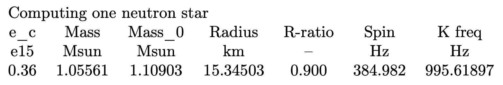
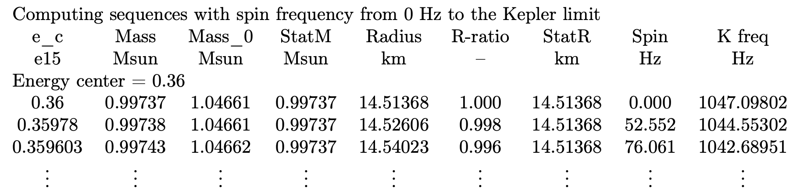

# NSSS (Neutron Star Spin Sequences)

Code to calculate sequences of neutron stars with constant baryonic mass. It's based on the the code stored in https://github.com/rns-alberta/isco.

**To see a more detailed explanation on how to run NSSS, see the file "NSSS-documentation.pdf" in this repository.**

NSSS is able to compute
* One neutron star (NS) with a certain value of oblateness
* Sequences of neutron stars (NSs) with constant rest mass (mass of the particles that make up the star) by increasing the rotational frequency from zero to the limiting spin frequency (Kepler limit)
* Sequences of neutron stars, each with constant M0, by increasing the rotational frequency from zero to a maximum frequency, given by the user

## One NS
An example of the command line to compute one NS is 
```
./nsss -f eos-master/eosL -e 0.36e15 -r 0.9
```
It uses the equation of state **L** in “eos-master”, the NS will have a central energy density of **0.36e15** g/cm3 and it will have a ratio of the polar and the equatorial radii of rp/re = **0.9**. The output is the following


## A sequence of NSs

An example of an input line to compute 5 sequences would be
```
./nsss -f eos-master/eosL -e 0.36e15 -n 5 -m 1.44216
```
This command will take the equation of state **L**, it will also need a starting value of the central energy density, **0.36e15** g/cm3. It will compute **n=5** sequences of NSs, each with a constant rest mass. **-m 1.44216** tells NSSS to compute the nonrotating neutron star with the highest mass for the equation of state L, which happens at 1.44216e15 g/cm3 (There is no need to type “e15” for this parameter). The output is the following



## A sequence of NSs up to a certain rotational frequency

An example of the input line for this task is
```
./nsss -f eos-master/eosL -e 0.36e15 -n 5 -m 1.44216 -t 800
```
The parameters are the same as the previous case, we just add **-t 800**, which tells NSSS that the sequences will finish when the NSs reach a spin frequency of **800 Hz**. The output data will be the same as the previous case, but now the statement above the headings will be *Computing star with spin frequency from 0 to 800 Hz*.


